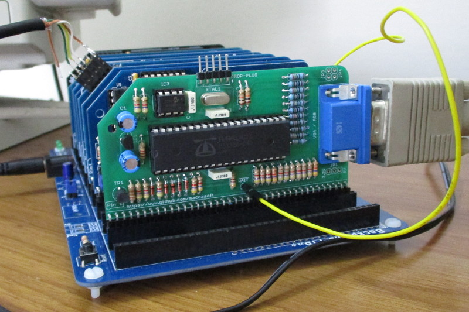
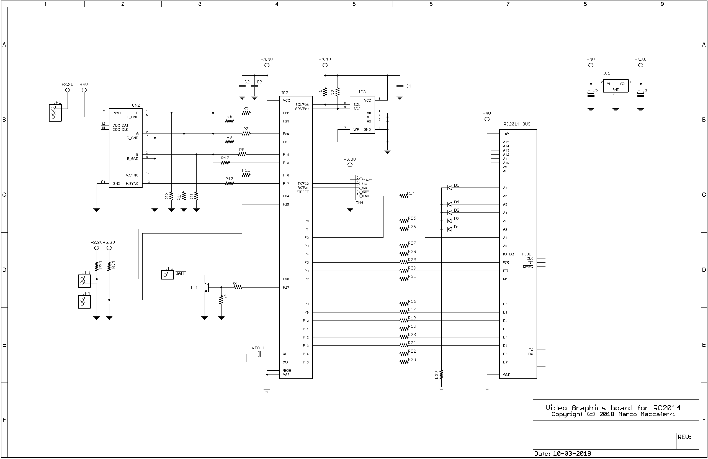

## Propeller Graphics Card

Add-on board and firmware designed for the [RC2014](http://rc2014.co.uk/) computer to provide graphics capabilities.

### Specifications

 * Resolution up to 320x240 pixels with 64 colors
 * Tile graphics with 8x8 pixels tiles, 8x8 up to 32x32 pixels sprites
 * RGB PAL, NTSC and VGA output

The board uses I/O ports **40H, 41H, 42H and 43H** for programming.

### Schematic

| Parts List            |                     |          |                                 |
| --------------------- | ------------------- | -------- | ------------------------------- |
| R1, R2, R16-R31       | 4.700 ohm 1/4 watt  | IC1      | MCP1700-3302E/TO                |
| R3                    | 1.200 ohm 1/4 watt  | IC2      | P8X32A-D40                      |
| R4                    | 33.000 ohm 1/4 watt | IC3      | 24LC512                         |
| R5, R7, R9            | 510 ohm 1/4 watt 1% | TR1      | NPN Transistor BC547            |
| R6, R8, R10, R11, R12 | 240 ohm 1/4 watt 1% | JP1      | 3 pin male header               |
| R13, R14, R15         | 130 ohm 1/4 watt 1% | JP2      | 1 pin male header               |
| R32, R33, R34         | 10.000 ohm 1/4 watt | JP3, JP4 | 2 pin male header               |
| C1, C5                | 10 uF 63v elettr.   | CN1      | 40 pin male header, right angle |
| C2, C3, C4            | 100.000 pF poly.    | CN2      | DB15 HD female connector        |
| D1, D2, D3, D4, D5    | 1N4148              | CN4      | 5 pin male header               |
| XTAL1                 | 5 MHz crystal       |          |                                 |

Board shared on [OSHPark](https://oshpark.com/shared_projects/1gud4wQD).

