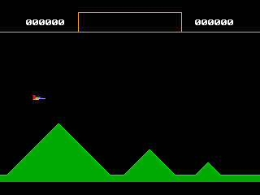
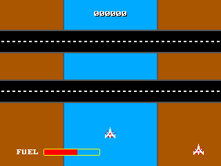

## Propeller Graphics Card

Utilities and demo programs designed to run with CP/M.

 * **fwupd.com**  
   Firmware update utility.  
   
 * **hscroll.com**  
   Horizontal scroll with music demo.  
     
 * **vscroll.com**  
   Vertical scroll with music demo.  
     

All programs can be compiled with [z88dk](https://www.z88dk.org) using the provided Makefile or individually using the instructions in the source files.

### License

Unless otherwise specified all programs are distributed with the GNU GPL-V3 license, images, design files and other artwork
are distributed under the Creative Commons Attribution-ShareAlike 3.0 license.
